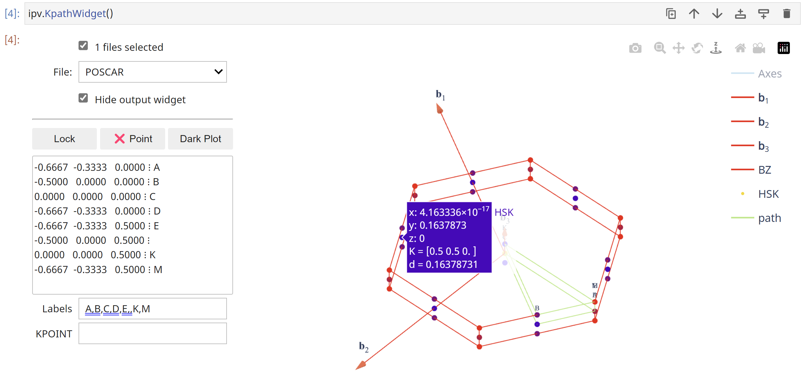

# ipyvasp

An successor of [pivotpy](https://github.com/massgh/pivotpy) for VASP-based DFT pre and post processing tool.

## Install
Currently the package is being built and not stable. If you want to use development version, install this way:(recommended to install in a virtual environment)
```
git clone https://github.com/massgh/ipyvasp.git
cd ipyvasp
pip install -e .
```

## Showcase Examples
Plot 2D BZ layer on top of 3D!

```python
import ipyvasp as ipv
pos =  ipv.POSCAR('FCC POSACR FILE').set_zdir([1,1,1])
ax = pos.splot_bz(vectors = None,color='skyblue',lw=0.2,alpha=0.2,fill=True)

kpts = [[0,-1/2,0],[0,0,0]]
pos.splot_kpath(kpts,labels=[str(k) for k in kpts],zorder=-1) # At 3D BZ

pos2 = pos.transform(lambda a,b,c: (a-c, b-c, a+b+c)) # 111 plane
pos2.splot_bz('xy',ax=ax,zoffset=0.15,vectors=None,color='navy')

kp2 = pos.bz.map_kpoints(pos2.bz, kpts)
pos2.splot_kpath(kp2,labels=[str(k) for k in kp2.round(1).tolist()],color='navy',fmt_label=lambda lab: (lab+'\n', dict(va='center',color='navy')),zorder=3) 

ax.set_axis_off()
```


Interactively select bandstructure path by clicking on high symmetry points on plot!



More coming soon!


