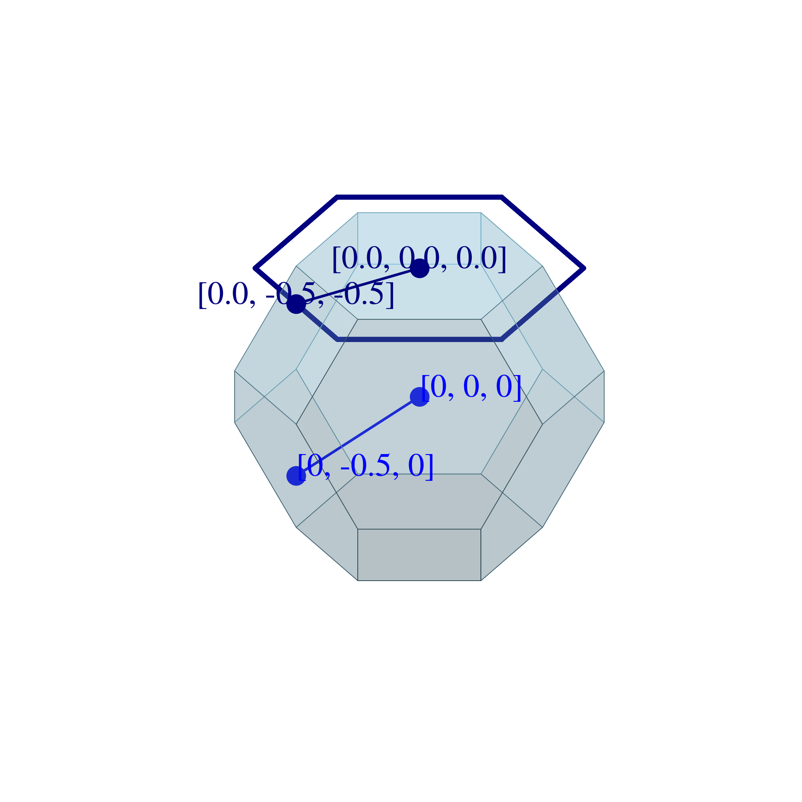
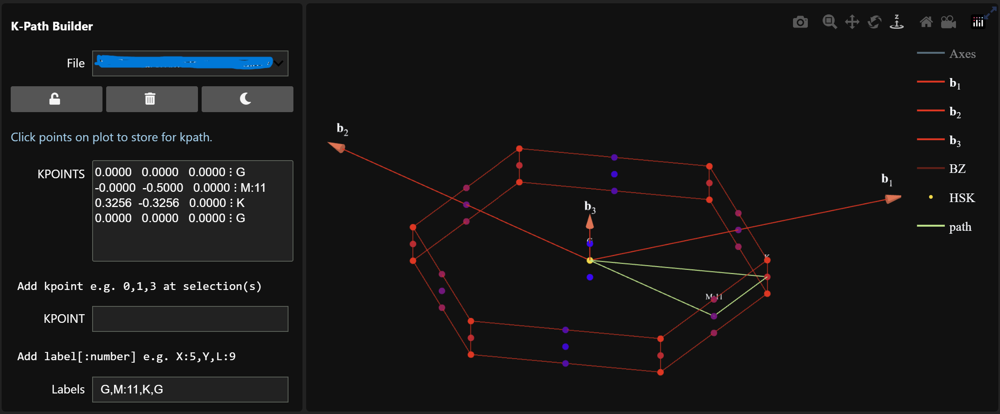

# ipyvasp

An successor of [pivotpy](https://github.com/massgh/pivotpy) for VASP-based DFT pre and post processing tool.

## Install
Currently the package is being built and not stable. If you want to use development version, install this way:(recommended to install in a virtual environment)
```
git clone https://github.com/massgh/ipyvasp.git
cd ipyvasp
pip install -e .
```

## Showcase Examples
Plot 2D BZ layer on top of 3D!

```python
import ipyvasp as ipv
pos =  ipv.POSCAR('FCC POSACR FILE').rotate(35, [0,0,1])
ax = pos.splot_bz(vectors = None,color='skyblue',lw=0.5,alpha=0.8)
pos.splot_bz('xy', ax=ax, zoffset = pos.bz.vertices[:,2].max(), vectors=None, lw=1,color='red',zorder=4)
pos.splot_bz('xy', ax=ax, zoffset = pos.bz.vertices[:,2].min(), vectors=None, lw=1,color='blue',zorder=0)
```



Interactively select bandstructure path by clicking on high symmetry points on plot!



More coming soon!


